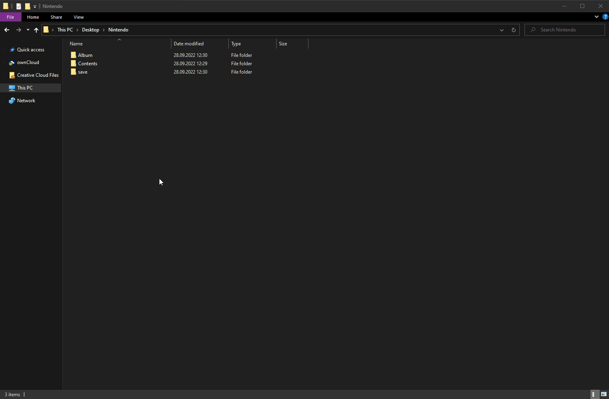
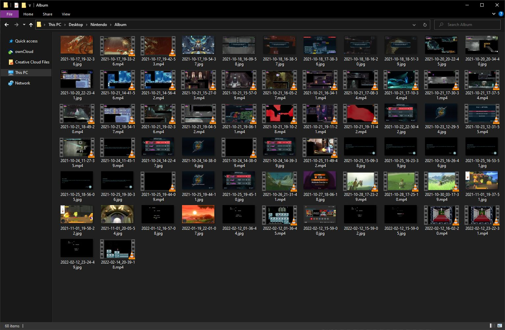

# Summary

This repo has two scripts that will help you manage your screenshots and recording from your Switch:

1. flatten_sdcard_album.py - will flatten directory structure of an album from the Switch SD card, and rename the files nicely.
2. rename_files_from_usb.py - will just rename the files from the Album copied via USB connection to a PC.

# Disclaimer

These scripts are provided as-is. I am not responsible if they delete your data, or eat your homework, or whatever. Make backups before running the scripts and don't tell me I didn't warn you!

# flatten_sdcard_album

Will move all the files from their respective subfolders into the `Album` folder and rename them in `YYYY-MM-DD_HH-mm-SS` format, keeping their original extensions.

## Before

```text
Album
├── 2021
│   ├── 10
│   │   ├── 17
│   │   │   └── 2021101719543700-9A9B6E0371D34263D6B6577F9CBA54D5.jpg
│   │   ├── 18
│   │   │   └── 2021101818513900-9A9B6E0371D34263D6B6577F9CBA54D5.jpg
│   │   └── 30
│   │       └── 2021103003173900-F1C11A22FAEE3B82F21B330E1B786A39.mp4
│   └── 11
│       └── 01
│           └── 2021110120055400-638E7E1EEC4CD8A239243633C0345A07.jpg
└── 2022
    ├── 01
    │   ├── 12
    │   │   └── 2022011216570800-12450B0C782F38E35EF964906DB929D1.jpg
    │   └── 19
    │       └── 2022011922010700-638E7E1EEC4CD8A239243633C0345A07.jpg
    └── 02
        ├── 12
        │   └── 2022021223244900-12450B0C782F38E35EF964906DB929D1.jpg
        └── 14
            └── 2022021420391800-12450B0C782F38E35EF964906DB929D1.mp4
```

<details>
<summary>Show me more!</summary>

All the files are nested deep inside multiple folders and are a pain to browse through. Also, the file names are hard to read, ew.



</details>

## After

```text
Album
├── 2021-10-17_19-54-37.jpg
├── 2021-10-18_18-51-39.jpg
├── 2021-10-30_03-17-39.mp4
├── 2021-11-01_19-37-51.jpg
├── 2021-11-01_19-58-22.jpg
├── 2021-11-01_20-05-54.jpg
├── 2022-01-12_16-57-08.jpg
├── 2022-01-19_22-01-07.jpg
├── 2022-02-12_23-24-49.jpg
└── 2022-02-14_20-39-18.mp4
```

<details>
<summary>Show me more!</summary>

All the files are in one folder and have readable names.



</details>

## Usage

> `python flatten_sdcard_album.py <path_to_nintendo_album>`

For example, assuming you have the script in your `Downloads` folder and your Switch album on your desktop:

> `python ~/Downloads/flatten_sdcard_album.py ~/Desktop/Album`

# rename_files_from_usb

Will rename the files in their respective subfolders into `YYYY-MM-DD_HH-mm-SS<suffix>` format, keeping their original extensions. It will keep the files in their respective subfolders, since Switch conveniently names those after the games when using the USB mode.

## Before

```text
Switch
├──  Breath of the Wild
│   └── 2021103003173900_c.mp4
├── Contra Anniversary Collection
│   ├── 2022021223244900_c.jpg
│   └── 2022021420391800_c.mp4
├── Metroid Dread
│   ├── 2021102519303600_c.jpg
│   ├── 2021102519440900_c.mp4
│   ├── 2021102519441100_c.jpg
│   └── 2021102519451000_c.jpg
├── Other
│   └── 2022021215590000_c.jpg
└── Ring Fit Adventure
    └── 2022011922010700_c.jpg
```

## After

```text
Switch
├──  Breath of the Wild
│   └── 2021-10-30_03-17-39_00_c.mp4
├── Contra Anniversary Collection
│   ├── 2022-02-12_23-24-49_00_c.jpg
│   └── 2022-02-14_20-39-18_00_c.mp4
├── Metroid Dread
│   ├── 2021-10-25_19-30-36_00_c.jpg
│   ├── 2021-10-25_19-44-09_00_c.mp4
│   ├── 2021-10-25_19-44-11_00_c.jpg
│   └── 2021-10-25_19-45-10_00_c.jpg
├── Other
│   └── 2022-02-12_15-59-00_00_c.jpg
└── Ring Fit Adventure
    └── 2022-01-19_22-01-07_00_c.jpg
```

## Usage

> `python rename_files_from_usb.py <path_to_nintendo_album>`

For example, assuming you have the script in your `Downloads` folder and your Switch album in a `Switch` folder on your desktop:

> `python ~/Downloads/rename_files_from_usb.py ~/Desktop/Switch`
